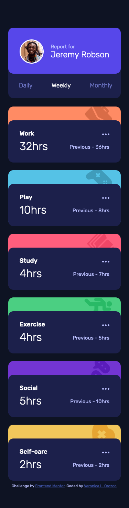
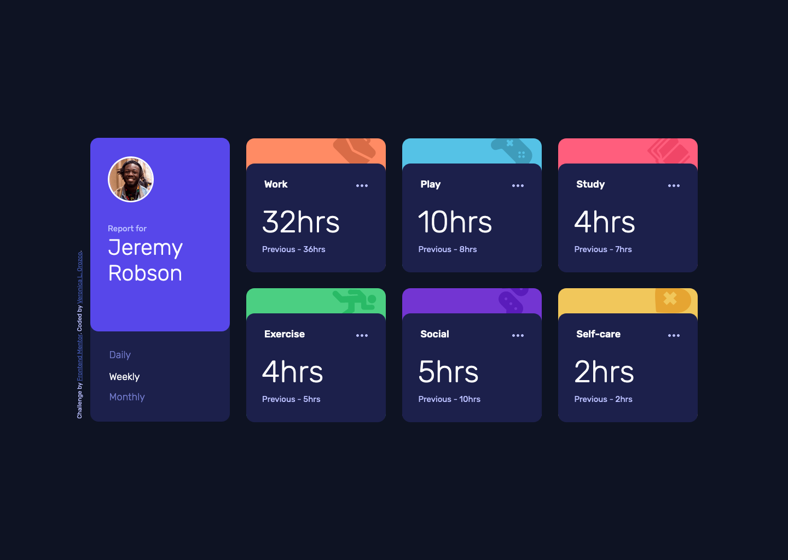

# Frontend Mentor - Time Tracking Dashboard

This is a solution to the [Time tracking dashboard challenge on Frontend Mentor](https://www.frontendmentor.io/challenges/time-tracking-dashboard-UIQ7167Jw). Frontend Mentor challenges help you improve your coding skills by building realistic projects.

## Table of contents

- [Frontend Mentor - Time Tracking Dashboard](#frontend-mentor---time-tracking-dashboard)
  - [Table of contents](#table-of-contents)
  - [Overview](#overview)
    - [The challenge](#the-challenge)
  - [Screenshots](#screenshots)
    - [Mobile View](#mobile-view)
    - [Desktop View](#desktop-view)
  - [My process](#my-process)
    - [Built with](#built-with)
    - [Links](#links)
    - [Useful resources](#useful-resources)
  - [Author](#author)

---
## Overview

### The challenge

Users should be able to:

- View the optimal layout for the site depending on their device's screen size
- See hover states for all interactive elements on the page
- Switch between viewing Daily, Weekly, and Monthly stats

---
## Screenshots

### Mobile View

### Desktop View

---
## My process

### Built with

- HTML5
- CSS
- CSS Flexbox & Grid
- JavaScript | switch view for daily/weekly/monthly hours
- Mobile-first workflow

---
### Links

- Solution URL: [Github Code](https://github.com/VLOrozco/time-tracking-dashboard.git)

- Live Site URL: [Interactive Rating Component](https://vlorozco.github.io/time-tracking-dashboard/)

---
### Useful resources

- WebKit CSS extensions: [mdn web docs_](https://developer.mozilla.org/en-US/docs/Web/CSS/WebKit_Extensions)

- CSS background-image Property: [W3Schools](https://www.w3schools.com/cssref/pr_background-image.asp)
  
- :nth-child(): [mdn web docs_](https://developer.mozilla.org/en-US/docs/Web/CSS/:nth-child)

- Text Rotation: [*CSS-TRICKS](https://css-tricks.com/snippets/css/text-rotation/)

- NodeList.prototype.forEach(): [mdn web docs_](https://developer.mozilla.org/en-US/docs/Web/API/NodeList/forEach)

---

## Author

- VLOrozco Portolio Website - [Veronica L. Orozco](https://vlorozco.com)
- Github - [Veronica L. Orozco](https://github.com/VLOrozco)
- Frontend Mentor - [@VLOrozco](https://www.frontendmentor.io/profile/VLOrozco)
- Codecademy - [orozcov3](https://www.codecademy.com/profiles/orozcoV3)
